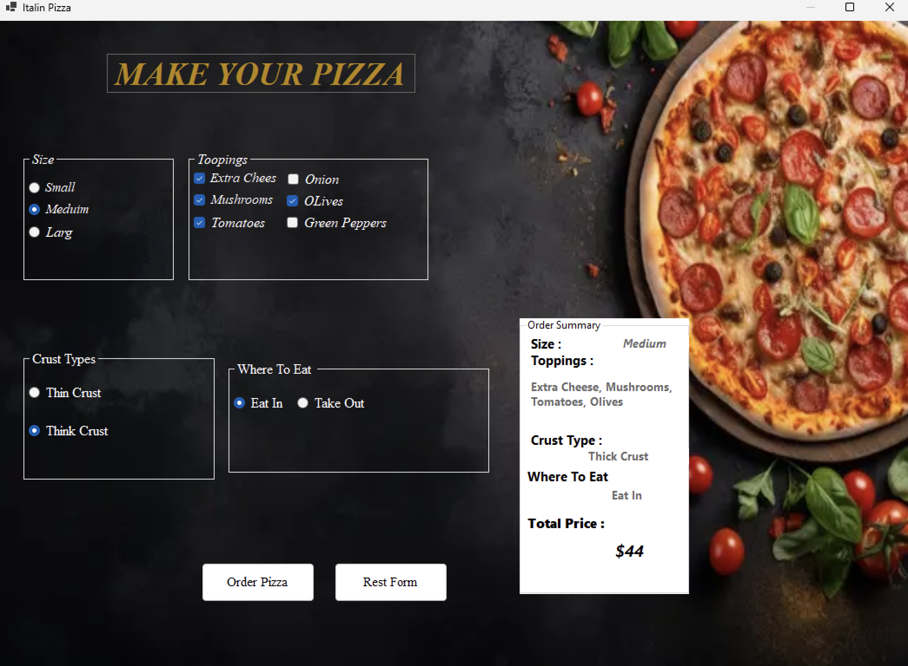
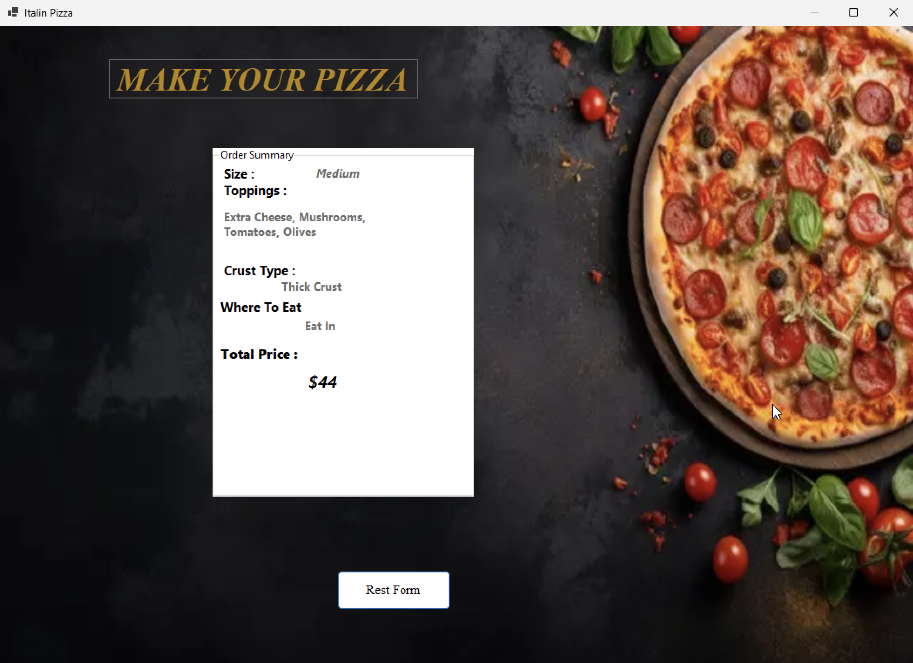

# 🍕 Italian Pizza Order
A simple Pizza Ordering System built with **C# and Windows Forms**.
This project  was created for educational purposes , and mainly focuses  on practicing **OOP, Divide and Conquer, event handling, and clean logic** rather than building a large application.
## What I Practiced
- **OOP:** Organized the pizza logic into separate methods instead of putting everything inside event handlers.
- **Divide and Conquer:** Broke the pricing and UI update logic into small, focused functions.
- **Dynamic Price Calculation:** The total price is recalculated based on the current selections. Adding or removing toppings always updates the correct total without accumulating previous values.
- **Order Summary:** The summary is updated automatically whenever the user changes the pizza options.
- **Reset Function:** Resets the form and returns the application to its initial state.
- **Keyboard Navigation:** Added `Tab` navigation so the application can be used without relying on the mouse.
## Main Logic
The price is calculated from the current selections:
```text
Pizza Size
    +
Toppings
    +
Crust
    +
Where To Eat
    =
Total Price

Each option uses its Tag property to store its price, making the calculation easier to maintain.

What I Learned

This project helped me practice:

* C# and Windows Forms
* OOP principles
* Divide and Conquer
* Event-driven programming
* Working with Control Properties and Tag
* Dynamic calculations
* Keyboard accessibility

📸 Screenshots

-Main Interface

-Order Summary


🛠️ Built With

* C#
* .NET
* Windows Forms
* Visual Studio / JetBrains Rider🛠️ Built With

* C#
* .NET
* Windows Forms
* Visual Studio / JetBrains Rider

* .NET
* Windows Forms
* Visual Studio / JetBrains Rider


